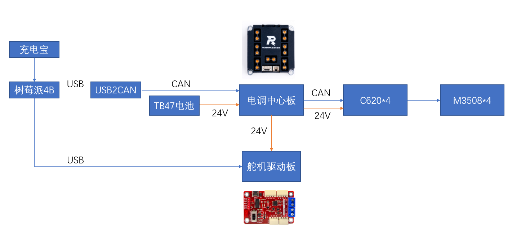

# 硬件说明

### 物料
- 树莓派4B * 1
- USB转CAN * 1（SocketCAN）
- Feetach舵机驱动板 * 1
- XBox手柄一只，有线无线均可。**建议使用ASOC同款，不要用正版的会有驱动问题。**


### 机电连线
- 树莓派4B需连接USB转CAN的小板子。调试阶段中用的是一块小的，绿色手指大小的板子，之后可以也用它。板子上有拉出一条GH1.25的CAN线，应当被接在中心板上。

- 树莓派可以用一个充电宝供电。

- **舵机驱动板的24V供电那两根线要点锡！！点锡！！点锡！！小心短路！！** 

  

### 电机ID
目前ID配置如下：
- 0x201 - 右前轮
- 0x202 - 左前轮
- 0x203 - 右后轮
- 0x204 - 左后轮

车体方向的前后左右定义可能有误，建议直接修改代码。

# 软件说明

## 依赖项
- ROS Kinetic或Melodic。
- ROS Joy包。

## 软件包结构
```
|- scripts : python节点相关文件
|   |- scservo_sdk 飞特舵机sdk
|   |   |- ...
|   |- servo.py 舵机类封装
|   |- test.py 舵机控制节点
|- src : C++节点相关文件
|   |- socketCan2 : Dji电机的SocketCan驱动
|   |   |- src
|   |   |- inc
|   |- ChassisController.cpp : 底盘控制节点
|- images : readme.md的图片
|- CMakeLists.txt 
|- package.xml
|- readme.md
```

## 环境配置

建议连个显示器完成下列工作，等大概内容都测过之后再用ssh。

0. 正确安装Ubuntu和ROS；确保所有机电接线连接无误，电调ID配置正确。

1. 安装手柄控制的ROS包`Joy`。
> `sudo apt-get install ros-<version>-joy` 

2. 创建一个工作空间，详情可[参见ROSWiki的这篇教程](http://wiki.ros.org/ROS/Tutorials/InstallingandConfiguringROSEnvironment#Create_a_ROS_Workspace)。

> `mkdir ~/catkin_ws`
> `cd ~/catkin_ws`
> `mkdir src`
> `catkin_make`

编译成功后，应当能看到三个子目录：devel, build以及src。随后将此工作空间加入ros的检索范围：

> `source ~/catkin_ws/devel/setup.bash`


3. 将包下载至src目录下，然后再次编译包。

> `cd ~/catkin_ws/src`
> `git clone https://github.com/Infas12/WheeLeg.git`
> `cd ..`
> `catkin_make`

如果编译顺利通过，应该就可以使用了。

## 测试

1. 启动joy节点。

> `rosrun joy joy_node`

2. 启动wheelLeg的Chassis节点，控制底盘。

> `rosrun WheeLeg chassis`

现在，推动左右摇杆，四个轮子应该会跟着动了。

可能的报错：

* 如果提示找不到包/节点，可能有如下几种情况：
    * 可能没有`source devel/setup.bash`。在这种情况下，ros会找不到工作空间，也就找不到其下的包。每次source，生效的范围只有一个terminal。如果添加到了~/.bashrc中就可以开terminal的时候自动执行。

    * 可能我记错了节点名....... 建议用自动补全。

* 如果提示can相关报错，首先检查socketCAN有没有正确连接在树莓派上，然后再看能不能work。

3. 启动wheeLeg的舵机控制节点。舵机节点是用python写的。

> `rosrun WheeLeg test.py`

现在，按下手柄上的`B`键，舵机应当就会运动。

可能的报错：

* 如果提示找不到`test.py`，可能是没有给文件设置正确的权限。
> `chmod +x test.py`

如果出现了其他报错请直接联系我。


